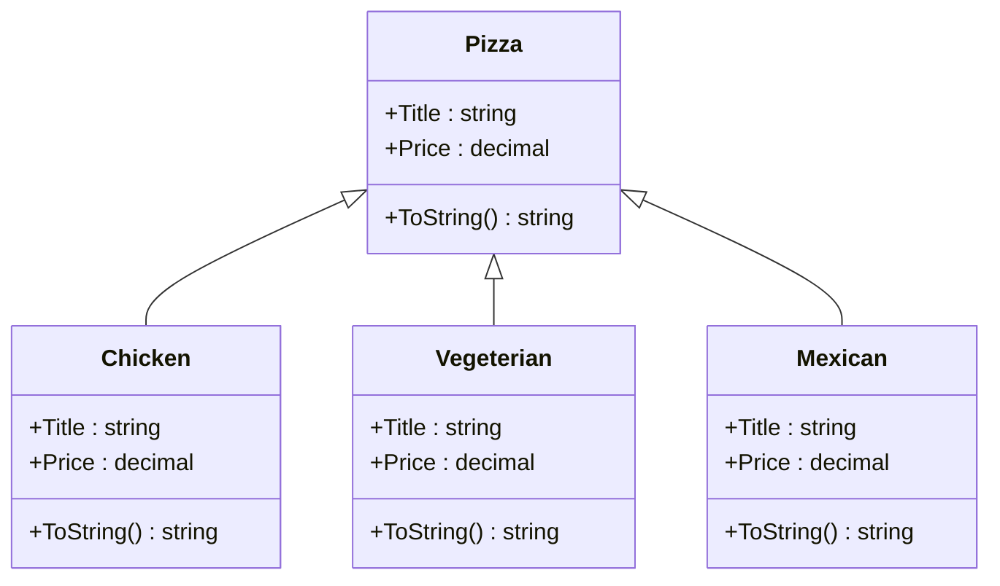
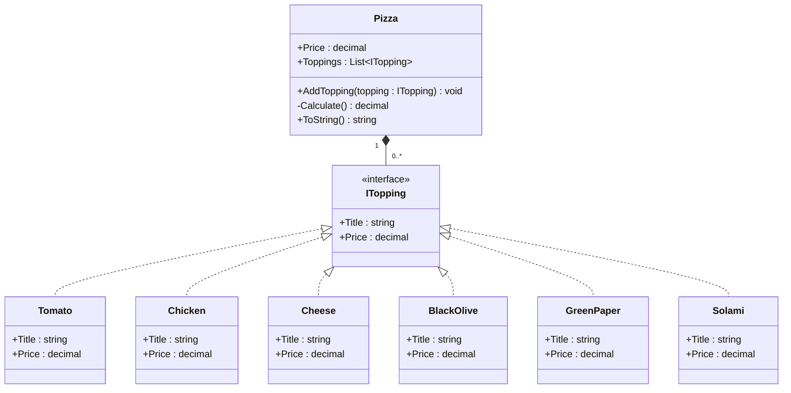

# Favor Composition Over Inheritance

> Instead of building rigid class hierarchies with inheritance, build flexible objects by **composing** them from smaller, interchangeable parts.

- **Inheritance** → "IS-A" relationship (a `Chicken` pizza **is a** `Pizza`)
- **Composition** → "HAS-A" relationship (a `Pizza` **has** `Toppings`)

---

## The Idea

Inheritance is great for expressing a *fixed*, *simple* hierarchy — but it becomes a problem when you need **combinations** of behavior. If every new variation forces you to create a brand-new subclass, your class hierarchy explodes in size and becomes hard to maintain.

Composition solves this by building objects out of smaller, independent pieces (usually defined by an interface) that can be mixed and matched freely at **runtime**, without ever touching the class structure.

---

## 1) The Problem — Inheritance

Each type of pizza is a specialized class that **inherits** from `Pizza`.

### UML



**Notation:** the hollow triangle arrow means **Inheritance (Generalization)**.

### Code

```csharp
using System;
using System.Threading;

namespace CAFavorCompositionOverInheritance
{
    class Program
    {
        static void Main(string[] args)
        {
            var choice = 0;
            do
            {
                Console.Clear();
                choice = ReadChoice(choice);
                if (choice >= 1 && choice <= 3)
                {
                    var pizza = CreatePizza(choice);
                    Console.WriteLine(pizza);
                    Console.WriteLine("Press any key to continue");
                }
                Console.ReadKey();
            } while (choice != 0);
        }

        private static int ReadChoice(int choice)
        {
            Console.WriteLine("Today's Menu");
            Console.WriteLine("------------");
            Console.WriteLine("1. Chicken");
            Console.WriteLine("2. Vegeterian");
            Console.WriteLine("3. Mexican");
            Console.WriteLine("what is your order: ");
            if (int.TryParse(Console.ReadLine(), out int ch))
            {
                choice = ch;
            }

            return choice;
        }

        private static Pizza CreatePizza(int choice)
        {
            Pizza pizza = null;
            switch (choice)
            {
                case 1:
                    pizza = new Chicken();
                    break;
                case 2:
                    pizza = new Vegeterian();
                    break;
                case 3:
                    pizza = new Mexican();
                    break;
                default:
                    break;
            }
            return pizza;
        }
    }

    class Pizza
    {
        public virtual string Title => $"{nameof(Pizza)}";
        public virtual decimal Price => 10m;

        public override string ToString()
        {
            return $"\n{Title}" +
                   $"\n\tPrice: {Price.ToString("C")}";
        }
    }

    class Mexican : Pizza
    {
        public override string Title => $"{base.Title} {nameof(Mexican)}";
        public override decimal Price => base.Price + 3m;
    }

    class Chicken : Pizza
    {
        public override string Title => $"{base.Title} {nameof(Chicken)}";
        public override decimal Price => base.Price + 6m;
    }

    class Vegeterian : Pizza
    {
        public override string Title => $"{base.Title} {nameof(Vegeterian)}";
        public override decimal Price => base.Price + 4m;
    }
}
```

### Key Point

- `Chicken` **IS-A** `Pizza`
- `Vegeterian` **IS-A** `Pizza`
- `Mexican` **IS-A** `Pizza`

> ⚠️ This can lead to a lot of classes if you need combinations (e.g., `Chicken + Cheese + Tomato`, etc.). Inheritance can only express one dimension of variation — it can't cleanly represent "a pizza with several toppings at once."

---

## 2) The Solution — Composition

`Pizza` **has many** `Toppings`. Toppings are separate classes that all implement a common `ITopping` interface.

### UML



**Notation:**
- Filled diamond arrow = **Composition (Whole/Part)**
- Dashed hollow triangle = **Realization (Interface Implementation)**
- `0..*` = **Multiplicity (Zero or more)**

### Code

```csharp
using System;
using System.Collections.Generic;

namespace CAFavorCompositionOverInheritanceAfter
{
    class Program
    {
        static void Main(string[] args)
        {
            var choice = 0;
            var pizza = new Pizza();
            do
            {
                Console.Clear();
                choice = ReadChoice(choice);
                if (choice >= 1 && choice <= 6)
                {
                    ITopping topping = null;
                    switch (choice)
                    {
                        case 1:
                            topping = new Tomato();
                            break;
                        case 2:
                            topping = new Chicken();
                            break;
                        case 3:
                            topping = new Cheese();
                            break;
                        case 4:
                            topping = new BlackOlive();
                            break;
                        case 5:
                            topping = new GreenPaper();
                            break;
                        case 6:
                            topping = new Solami();
                            break;
                        default:
                            break;
                    }
                    pizza.AddTopping(topping);
                    Console.WriteLine("Press any key to continue");
                }
                Console.ReadKey();
            } while (choice != 0);
            Console.WriteLine(pizza);
            Console.ReadKey();
        }

        private static int ReadChoice(int choice)
        {
            Console.WriteLine("Available Topping");
            Console.WriteLine("------------");
            Console.WriteLine("1. Tomato");
            Console.WriteLine("2. Chicken");
            Console.WriteLine("3. Cheese");
            Console.WriteLine("4. Black Olives");
            Console.WriteLine("5. Green Paper");
            Console.WriteLine("6. Solami");
            Console.WriteLine("select topping: ");
            if (int.TryParse(Console.ReadLine(), out int ch))
            {
                choice = ch;
            }

            return choice;
        }
    }

    class Pizza
    {
        public virtual decimal Price => 10m;

        public List<ITopping> Toppings { get; private set; } = new List<ITopping>();

        public void AddTopping(ITopping topping) => Toppings.Add(topping);

        private decimal Calculate()
        {
            var total = Price;
            foreach (var item in Toppings)
            {
                total += item.Price;
            }
            return total;
        }

        public override string ToString()
        {
            var output = $"\n{nameof(Pizza)}";
            output += $"\n\tBase Price: ({Price.ToString("C")})";
            foreach (var topping in Toppings)
            {
                output += $"\n\t {topping.Title} ({topping.Price.ToString("C")})";
            }
            output += "\n-----------------------";
            output += $"\nTotal: {Calculate().ToString("C")}";
            return output;
        }
    }

    public interface ITopping
    {
        string Title { get; }
        decimal Price { get; }
    }

    public class Tomato : ITopping
    {
        public string Title => nameof(Tomato);
        public decimal Price => 3m;
    }

    public class Chicken : ITopping
    {
        public string Title => nameof(Chicken);
        public decimal Price => 6m;
    }

    public class Cheese : ITopping
    {
        public string Title => nameof(Cheese);
        public decimal Price => 4m;
    }

    public class BlackOlive : ITopping
    {
        public string Title => nameof(BlackOlive);
        public decimal Price => 2m;
    }

    public class GreenPaper : ITopping
    {
        public string Title => nameof(GreenPaper);
        public decimal Price => 2.5m;
    }

    public class Solami : ITopping
    {
        public string Title => nameof(GreenPaper); // Note: this looks like a copy-paste bug — should probably be nameof(Solami)
        public decimal Price => 7.5m;
    }
}
```

### Key Point

- `Pizza` **HAS-A** many `Toppings`
- Toppings are separate classes implementing the `ITopping` interface
- **More flexible:** you can add **any combination** of toppings at runtime **without creating new pizza classes**

---

## Comparing the Two Approaches

| | Inheritance (Before) | Composition (After) |
|---|---|---|
| Relationship | IS-A | HAS-A |
| New variation | Requires a new subclass | Requires a new small class implementing `ITopping` |
| Combinations | Not supported (one pizza = one class) | Fully supported (any number of toppings) |
| Flexibility | Fixed at compile time | Configurable at runtime |
| Class explosion risk | High (grows with every combination) | Low (grows linearly with topping types) |

---

## Key Takeaway

> Inheritance locks behavior into a rigid hierarchy decided at compile time. Composition builds behavior dynamically out of small, reusable, interchangeable parts.
>
> When you find yourself needing combinations of behavior — not just single variations — **favor composition over inheritance**.
