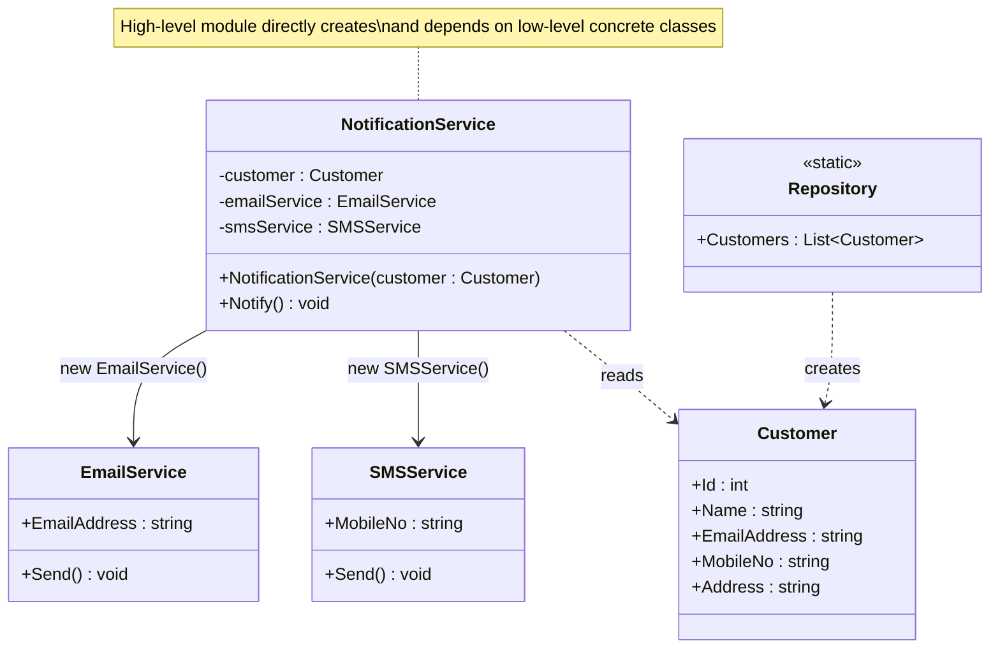
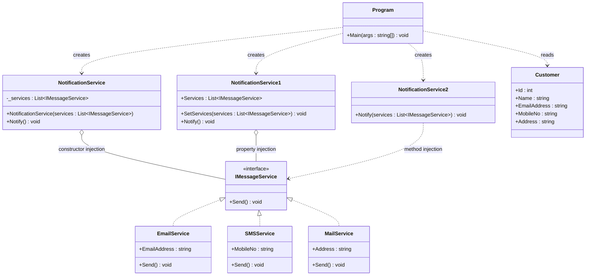

# SOLID — Dependency Inversion Principle (DIP)

> High-level modules should not depend on low-level modules. Both should depend on **abstractions**.
> Abstractions should not depend on details. Details should depend on abstractions.

- **High-level module** → the class that orchestrates behavior (`NotificationService`)
- **Low-level module** → the class that does the concrete work (`EmailService`, `SMSService`, `MailService`)
- The fix is always the same: put an **interface** between them, and have the high-level module depend on that interface instead of on the concrete classes.

This README walks through the `Before` and `After` code from [`metigator/DesignPrinciples_SOLID_DIP`](https://github.com/metigator/DesignPrinciples_SOLID_DIP).

---

## What DIP Actually Means

"Dependency Inversion" doesn't mean "avoid dependencies" — every useful class depends on something. It means **inverting the direction** of that dependency:

- **Without DIP:** `NotificationService` (high-level) directly creates and depends on `EmailService` and `SMSService` (low-level). The high-level policy is chained to specific implementation details.
- **With DIP:** both `NotificationService` and the concrete services depend on a shared abstraction, `IMessageService`. Neither one depends on the other directly — they both point **inward**, toward the interface.

This is what makes the principle "inverted": instead of high-level code depending downward on low-level code, the dependency arrow is flipped so that **low-level code depends upward on an abstraction owned/used by the high-level code**.

---

## 1) The Problem — Before (Violating DIP)

`NotificationService` directly instantiates `EmailService` and `SMSService` inside its own constructor. It owns their creation and knows their concrete types.

### UML



**Notation:** a plain solid arrow (`——▷`) = a **direct dependency on a concrete class**, created with `new` inside the high-level module itself.

### Code

**`Customer.cs`**
```csharp
namespace SOLID.DIP.Before
{
    internal class Customer
    {
        public int Id { get; set; }
        public string Name { get; set; }
        public string EmailAddress { get; set; }
        public string MobileNo { get; set; }
        public string Address { get; set; }
    }
}
```

**`EmailService.cs`**
```csharp
using System;

namespace SOLID.DIP.Before
{
    internal class EmailService
    {
        public string EmailAddress { get; set; }

        public void Send()
        {
            Console.WriteLine($"e-mail is sent to {EmailAddress}");
        }
    }
}
```

**`SMSService.cs`**
```csharp
using System;

namespace SOLID.DIP.Before
{
    internal class SMSService
    {
        public string MobileNo { get; set; }

        public void Send()
        {
            Console.WriteLine($"SMS is sent to {MobileNo}");
        }
    }
}
```

**`NotificationService.cs`** — the violation:
```csharp
namespace SOLID.DIP.Before
{
    internal class NotificationService
    {
        private readonly Customer u9customer;
        private readonly EmailService emailService;
        private readonly SMSService smsService;

        public NotificationService(Customer customer)
        {
            emailService = new EmailService
            {
                EmailAddress = customer.EmailAddress
            };
            smsService = new SMSService
            {
                MobileNo = customer.MobileNo
            };
        }

        public void Notify()
        {
            emailService.Send();
            smsService.Send();
        }
    }
}
```

**`Repository.cs`**
```csharp
using System.Collections.Generic;

namespace SOLID.DIP.Before
{
    internal static class Repository
    {
        public static List<Customer> Customers =>
            new List<Customer>()
            {
                new Customer { Id = 1, Name = "John Doe", EmailAddress = "john.doe@example.com", MobileNo = "+1 (606)123-4567", Address = "123 2nd Avenue California, USA" },
                new Customer { Id = 2, Name = "Sarah Sarah", EmailAddress = "sarah.sarah@example.com", MobileNo = "+1 (606)124-4567", Address = "345 4th Avenue Florida, USA" },
                new Customer { Id = 3, Name = "Steve Pado", EmailAddress = "steve.pado@example.com", MobileNo = "+1 (606)125-4567", Address = "678 3rd Avenue Chicago, USA" }
            };
    }
}
```

### Why This Breaks DIP

- ❌ `NotificationService` (high-level policy: "notify the customer") is **hard-wired** to exactly two concrete channels — email and SMS — with `new` calls baked directly into its constructor.
- ❌ Adding a new channel (e.g. postal mail) means **editing `NotificationService` itself** — its constructor and its `Notify()` method both need new fields and new calls.
- ❌ Removing a channel, or making the set of channels configurable per customer, is impossible without rewriting `NotificationService`.
- ❌ `NotificationService` cannot be unit-tested in isolation — it always creates real `EmailService`/`SMSService` instances, so there's no way to substitute a test double.
- ❌ `EmailService` and `SMSService` share **no common abstraction**; they just happen to both have a `Send()` method. Nothing in the code enforces or documents that similarity.

---

## 2) The Solution — After (Following DIP)

A shared `IMessageService` interface is introduced. `EmailService`, `SMSService`, and a new `MailService` all implement it. `NotificationService` now depends only on `List<IMessageService>` — it never creates or names a concrete service type. The list of services is built **outside** `NotificationService` (in `Program.cs`) and handed in.

The repo demonstrates **three ways** to hand the dependency in — all valid forms of Dependency Injection:

| Class | Injection style | How the dependency arrives |
|---|---|---|
| `NotificationService` | **Constructor Injection** | Passed into the constructor, stored in a `readonly` field |
| `NotificationService1` | **Property Injection** | Set afterward via a `SetServices(...)` method / property |
| `NotificationService2` | **Method Injection** | Passed directly into `Notify(...)` each time it's called |

### UML



**Notation:**
- Dashed hollow triangle (`◁┄┄`) = **Realization (Interface Implementation)**
- Hollow diamond (`○——`) = **Aggregation** — the object is handed a list of services it holds onto
- Dashed arrow (`┄┄▷`) = **Dependency ("uses")** — used only momentarily, not stored

### Code

**`IMessageService.cs`** — the abstraction both sides now depend on:
```csharp
namespace SOLID.DIP.After
{
    internal interface IMessageService
    {
        void Send();
    }
}
```

**`EmailService.cs`**
```csharp
using System;

namespace SOLID.DIP.After
{
    internal class EmailService : IMessageService
    {
        public string EmailAddress { get; set; }

        public void Send()
        {
            Console.WriteLine($"e-mail is sent to {EmailAddress}");
        }
    }
}
```

**`SMSService.cs`**
```csharp
using System;

namespace SOLID.DIP.After
{
    internal class SMSService : IMessageService
    {
        public string MobileNo { get; set; }

        public void Send()
        {
            Console.WriteLine($"SMS is sent to {MobileNo}");
        }
    }
}
```

**`MailService.cs`** — a brand-new channel, added without touching `NotificationService`:
```csharp
using System;

namespace SOLID.DIP.After
{
    internal class MailService : IMessageService
    {
        public string Address { get; set; }

        public void Send()
        {
            Console.WriteLine($"e-mail is sent to { Address}");
        }
    }
}
```

**`NotificationService.cs`** — all three injection styles:
```csharp
using System.Collections.Generic;

namespace SOLID.DIP.After
{
    internal class NotificationService
    {
        public readonly List<IMessageService> _services;

        // Constructor Injection
        public NotificationService(List<IMessageService> services)
        {
            _services = services;
        }

        public void Notify()
        {
            foreach (var service in _services)
            {
                service.Send();
            }
        }
    }

    internal class NotificationService1
    {
        // Property Injection
        public List<IMessageService> Services { get; private set; } = new();

        public void Notify()
        {
            foreach (var service in Services)
            {
                service.Send();
            }
        }

        public void SetServices(List<IMessageService> services)
        {
            this.Services = services;
        }
    }

    internal class NotificationService2
    {
        // Method Injection
        public void Notify(List<IMessageService> services)
        {
            foreach (var service in services)
            {
                service.Send();
            }
        }
    }
}
```

**`Customer.cs`** and **`Repository.cs`** — unchanged in shape from the `Before` version, just moved into the `After` namespace.

**`Program.cs`** — where the concrete services are actually created and wired together:
```csharp
using System;
using System.Collections.Generic;

namespace SOLID.DIP
{
    internal class Program
    {
        static void Main(string[] args)
        {
            var customers = Before.Repository.Customers;
            foreach (var customer in customers)
            {
                var messageService = new List<After.IMessageService>
                {
                    new After.EmailService { EmailAddress = customer.EmailAddress },
                    new After.SMSService { MobileNo = customer.MobileNo },
                    new After.MailService { Address = customer.Address }
                };

                // constructor injection
                var notificationService = new After.NotificationService(messageService);
                notificationService.Notify();

                // property injection
                var notificationService1 = new After.NotificationService1();
                notificationService1.SetServices(messageService);
                notificationService1.Notify();

                // method injection
                var notificationService2 = new After.NotificationService2();
                notificationService2.Notify(messageService);
            }

            Console.ReadKey();
        }
    }
}
```

### Why This Now Honors DIP

- ✅ `NotificationService` (and its two siblings) never mention `EmailService`, `SMSService`, or `MailService` by name — only `IMessageService`.
- ✅ **Both** the high-level module (`NotificationService`) and the low-level modules (`EmailService`, `SMSService`, `MailService`) depend on the same abstraction, `IMessageService` — neither depends on the other directly.
- ✅ `MailService` was added as a **brand-new channel** without a single change to any `NotificationService*` class — only `Program.cs` (the composition point) needed to know about it.
- ✅ Each `NotificationService*` variant can be unit-tested with a fake `IMessageService` that just records calls, with zero real console output.
- ✅ The decision of *which* concrete services to use is made in exactly one place — `Program.cs` — instead of being buried inside the class that consumes them.

---

## Comparing the Two Approaches

| | Before (Violating DIP) | After (Following DIP) |
|---|---|---|
| What `NotificationService` depends on | Concrete `EmailService`, `SMSService` | Abstraction `IMessageService` |
| Who creates the concrete services | `NotificationService` itself (`new` in constructor) | `Program.cs` (composition point), passed in |
| Adding a new channel (`MailService`) | Requires editing `NotificationService` | Only `Program.cs` changes; `NotificationService` untouched |
| Testability | Hard — real services always run | Easy — inject a fake `IMessageService` |
| Ways to supply the dependency | None — always `new`-ed internally | Constructor, property, or method injection |

---

## Key Takeaway

> High-level orchestration logic shouldn't know or care about the concrete classes that do the low-level work — it should only know about an abstraction. Concrete implementations are created elsewhere (a composition root, like `Program.cs`) and handed in — via a constructor, a property, or a method parameter. This "inverts" the dependency: instead of the high-level module reaching downward for details, both the high-level and low-level code point inward toward a shared interface.
