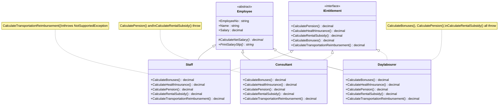
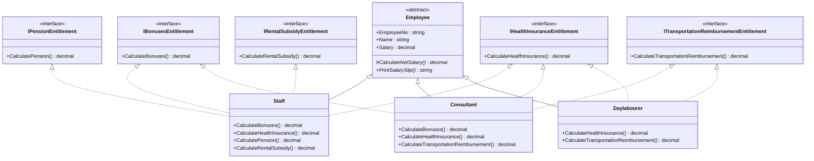

# SOLID — Interface Segregation Principle (ISP)

> Clients should not be forced to depend on methods (interfaces) they do not use.
>
> Prefer several small, focused interfaces over one large, "fat" interface that forces every implementer to support things it doesn't actually need.

---

## What ISP Actually Means

When you design one big interface with many methods, **every class that implements it must provide all of those methods** — even the ones that make no sense for that particular class. The implementer is forced to either:

- Implement the method properly (fine, if it applies), or
- **Fake it** — usually by throwing an exception (`NotSupportedException`) or returning a meaningless default.

That second case is a direct symptom of an interface that's too big. ISP says: **split the fat interface into smaller, role-specific interfaces**, so a class only implements the interfaces (and therefore the methods) that are actually relevant to it.

This is closely related to LSP — an implementer that throws `NotSupportedException` inside an interface method it was forced to add is also breaking substitutability for callers who trust the interface's contract.

---

## 1) The Problem — Before (Violating ISP)

A single "fat" interface, `IEntitlement`, bundles **five** unrelated entitlements together: bonuses, health insurance, pension, rental subsidy, and transportation reimbursement. But not every employee type qualifies for every entitlement:

| Entitlement | Staff | Consultant | Daylabourer |
|---|:---:|:---:|:---:|
| Bonuses | ✅ | ✅ | ❌ |
| Health Insurance | ✅ | ✅ | ✅ |
| Pension | ✅ | ❌ | ❌ |
| Rental Subsidy | ✅ | ❌ | ❌ |
| Transportation Reimbursement | ❌ | ✅ | ✅ |

Because all three classes implement the **same** `IEntitlement` interface, each one is forced to provide a method body for entitlements it doesn't actually offer — and the only thing left to do is **throw**.

### UML



### Code

**`IEntitlement.cs`** — one fat interface for everyone:
```csharp
namespace SOLID.ISP.Before
{
    interface IEntitlement
    {
        decimal CalculatePension();
        decimal CalculateHealthInsurance();
        decimal CalculateRentalSubsidy();
        decimal CalculateBonuses();
        decimal CalculateTransportationReimbursement();
    }
}
```

**`Employee.cs`**
```csharp
namespace SOLID.ISP.Before
{
    abstract class Employee
    {
        public string EmployeeNo { get; set; }
        public string Name { get; set; }
        public decimal Salary { get; set; }
        protected abstract decimal CalculateNetSalary();
        public abstract string PrintSalarySlip();
    }
}
```

**`Staff.cs`** — forced to fake `CalculateTransportationReimbursement`:
```csharp
using System;

namespace SOLID.ISP.Before
{
    class Staff : Employee, IEntitlement
    {
        public decimal CalculateBonuses() => Salary * 0.05m;
        public decimal CalculateHealthInsurance() => 300m;
        public decimal CalculatePension() => .025m * Salary;
        public decimal CalculateRentalSubsidy() => 150;

        public decimal CalculateTransportationReimbursement() =>
            throw new NotSupportedException("Staff TransportationReimbursement");

        protected override decimal CalculateNetSalary()
        {
            return Salary
                   + CalculateBonuses()
                   + CalculateHealthInsurance()
                   - CalculatePension()
                   + CalculateRentalSubsidy();
        }

        public override string PrintSalarySlip()
        {
            return $"\n --- {nameof(Staff)} ---" +
                   $"\n  No.: {EmployeeNo}" +
                   $"\n  Name: {Name}" +
                   $"\n  Basic Salary: {Salary.ToString("C2")}" +
                   $"\n  Bonuses: {CalculateBonuses().ToString("C2")}" +
                   $"\n  Pension: {CalculatePension().ToString("C2")}" +
                   $"\n  Health Insurance: {CalculateHealthInsurance().ToString("C2")}" +
                   $"\n  Rental Subsidy: {CalculateRentalSubsidy().ToString("C2")}" +
                   $"\n  ----------------------------------------------" +
                   $"\n  NetSalary: {CalculateNetSalary().ToString("C2")}";
        }
    }
}
```

**`Consultant.cs`** — forced to fake `CalculatePension` and `CalculateRentalSubsidy`:
```csharp
using System;

namespace SOLID.ISP.Before
{
    class Consultant : Employee, IEntitlement
    {
        public decimal CalculateBonuses() => Salary * 0.05m;
        public decimal CalculateHealthInsurance() => 300m;

        public decimal CalculatePension() =>
            throw new NotSupportedException("Consultant Pension not supported");

        public decimal CalculateRentalSubsidy() =>
            throw new NotSupportedException("Consultant Rental Subsidy not supported");

        public decimal CalculateTransportationReimbursement() => 150;

        protected override decimal CalculateNetSalary()
        {
            return Salary
                   + CalculateBonuses()
                   + CalculateHealthInsurance()
                   + CalculateTransportationReimbursement();
        }

        public override string PrintSalarySlip()
        {
            return $"\n --- {nameof(Consultant)} ---" +
                   $"\n  No.: {EmployeeNo}" +
                   $"\n  Name: {Name}" +
                   $"\n  Basic Salary: {Salary.ToString("C2")}" +
                   $"\n  Bonuses: {CalculateBonuses().ToString("C2")}" +
                   $"\n  Health Insurance: {CalculateHealthInsurance().ToString("C2")}" +
                   $"\n  Transportation Reimbursement: {CalculateTransportationReimbursement().ToString("C2")}" +
                   $"\n  ----------------------------------------------" +
                   $"\n  NetSalary: {CalculateNetSalary().ToString("C2")}";
        }
    }
}
```

**`Daylabourer.cs`** — forced to fake three of the five methods:
```csharp
using System;

namespace SOLID.ISP.Before
{
    class Daylabourer : Employee, IEntitlement
    {
        public decimal CalculateBonuses() =>
            throw new NotSupportedException("Day labourer Bonuses not supported");

        public decimal CalculateHealthInsurance() => 300m;

        public decimal CalculatePension() =>
            throw new NotSupportedException("Day labourer Pension not supported");

        public decimal CalculateRentalSubsidy() =>
            throw new NotSupportedException("Day labourer Rental Subsidy not supported");

        public decimal CalculateTransportationReimbursement() => 150;

        protected override decimal CalculateNetSalary()
        {
            return Salary
                + CalculateHealthInsurance()
                + CalculateTransportationReimbursement();
        }

        public override string PrintSalarySlip()
        {
            return $"\n --- {nameof(Daylabourer)} ---" +
                   $"\n  No.: {EmployeeNo}" +
                   $"\n  Name: {Name}" +
                   $"\n  Basic Salary: {Salary.ToString("C2")}" +
                   $"\n  Health Insurance: {CalculateHealthInsurance().ToString("C2")}" +
                   $"\n  Transportation Reimbursement: {CalculateTransportationReimbursement().ToString("C2")}" +
                   $"\n  ----------------------------------------------" +
                   $"\n  NetSalary: {CalculateNetSalary().ToString("C2")}";
        }
    }
}
```

**`Repository.cs`**
```csharp
using System.Collections.Generic;

namespace SOLID.ISP.Before
{
    static class Repository
    {
        public static IEnumerable<Employee> LoadEmployees()
        {
            return new List<Employee>
            {
                new Staff { EmployeeNo = "2017-FI-1343", Name = "Cochran Cole", Salary = 1000 },
                new Consultant { EmployeeNo = "2018-FI-1755", Name = "Jaclyn Wolfe", Salary = 1000 },
                new Daylabourer { EmployeeNo = "2016-IT-1441", Name = "Cochran Cole", Salary = 1000 }
            };
        }
    }
}
```

### Why This Breaks ISP

```csharp
void PayEntitlement(IEntitlement employee)
{
    Console.WriteLine(employee.CalculateTransportationReimbursement()); // works for Consultant/Daylabourer...
}
```

If a caller passes a `Staff` instance to code like this — which is exactly what the `IEntitlement` abstraction invites you to do — **the program crashes** with `NotSupportedException`.

- ❌ `Staff`, `Consultant`, and `Daylabourer` are each forced to implement methods that don't apply to them.
- ❌ Roughly a third of the methods across these three classes exist purely to **throw exceptions** — dead code that adds no value and hides real bugs until runtime.
- ❌ Any code written against `IEntitlement` is unsafe: it can't assume that *any* method is actually callable on *any* implementer.
- ❌ This also violates **LSP** — a `Staff` object cannot safely substitute for "anything that implements `IEntitlement`" without risking a crash.
- ❌ Adding a new entitlement (or a new employee type with a different combination of entitlements) means touching the shared interface **and every class that implements it**, even the ones unaffected by the change.

---

## 2) The Solution — After (Following ISP)

The single fat `IEntitlement` interface is **segregated** into five small, single-purpose interfaces — one per entitlement. Each employee class implements **only** the interfaces that actually apply to it.

### UML



Each class now only implements the interfaces matching the entitlement table above — **no more, no less**.

### Code

**The five segregated interfaces:**
```csharp
namespace SOLID.ISP.After
{
    interface IBonusesEntitlement
    {
        decimal CalculateBonuses();
    }
}
```
```csharp
namespace SOLID.ISP.After
{
    interface IHealthInsuranceEntitlement
    {
        decimal CalculateHealthInsurance();
    }
}
```
```csharp
namespace SOLID.ISP.After
{
    interface IPensionEntitlement
    {
        decimal CalculatePension();
    }
}
```
```csharp
namespace SOLID.ISP.After
{
    interface IRentalSubsidyEntitlement
    {
        decimal CalculateRentalSubsidy();
    }
}
```
```csharp
namespace SOLID.ISP.After
{
    interface ITransportationReimbursementEntitlement
    {
        decimal CalculateTransportationReimbursement();
    }
}
```

**`Employee.cs`** — unchanged:
```csharp
namespace SOLID.ISP.After
{
    abstract class Employee
    {
        public string EmployeeNo { get; set; }
        public string Name { get; set; }
        public decimal Salary { get; set; }
        protected abstract decimal CalculateNetSalary();
        public abstract string PrintSalarySlip();
    }
}
```

**`Staff.cs`** — implements only Bonuses, Health Insurance, Pension, Rental Subsidy:
```csharp
namespace SOLID.ISP.After
{
    class Staff : Employee, IHealthInsuranceEntitlement, IPensionEntitlement, IRentalSubsidyEntitlement, IBonusesEntitlement
    {
        public decimal CalculateBonuses() => Salary * 0.05m;
        public decimal CalculateHealthInsurance() => 300m;
        public decimal CalculatePension() => .025m * Salary;
        public decimal CalculateRentalSubsidy() => 150;

        protected override decimal CalculateNetSalary()
        {
            return Salary
                   + CalculateBonuses()
                   + CalculateHealthInsurance()
                   - CalculatePension()
                   + CalculateRentalSubsidy();
        }

        public override string PrintSalarySlip()
        {
            return $"\n --- {nameof(Staff)} ---" +
                   $"\n  No.: {EmployeeNo}" +
                   $"\n  Name: {Name}" +
                   $"\n  Basic Salary: {Salary.ToString("C2")}" +
                   $"\n  Bonuses: {CalculateBonuses().ToString("C2")}" +
                   $"\n  Pension: {CalculatePension().ToString("C2")}" +
                   $"\n  Health Insurance: {CalculateHealthInsurance().ToString("C2")}" +
                   $"\n  Rental Subsidy: {CalculateRentalSubsidy().ToString("C2")}" +
                   $"\n  ----------------------------------------------" +
                   $"\n  NetSalary: {CalculateNetSalary().ToString("C2")}";
        }
    }
}
```

**`Consultant.cs`** — implements only Bonuses, Health Insurance, Transportation:
```csharp
namespace SOLID.ISP.After
{
    class Consultant : Employee, IBonusesEntitlement, IHealthInsuranceEntitlement, ITransportationReimbursementEntitlement
    {
        public decimal CalculateBonuses() => Salary * 0.05m;
        public decimal CalculateHealthInsurance() => 300m;
        public decimal CalculateTransportationReimbursement() => 150;

        protected override decimal CalculateNetSalary()
        {
            return Salary
                   + CalculateBonuses()
                   + CalculateHealthInsurance()
                   + CalculateTransportationReimbursement();
        }

        public override string PrintSalarySlip()
        {
            return $"\n --- {nameof(Consultant)} ---" +
                   $"\n  No.: {EmployeeNo}" +
                   $"\n  Name: {Name}" +
                   $"\n  Basic Salary: {Salary.ToString("C2")}" +
                   $"\n  Bonuses: {CalculateBonuses().ToString("C2")}" +
                   $"\n  Health Insurance: {CalculateHealthInsurance().ToString("C2")}" +
                   $"\n  Transportation Reimbursement: {CalculateTransportationReimbursement().ToString("C2")}" +
                   $"\n  ----------------------------------------------" +
                   $"\n  NetSalary: {CalculateNetSalary().ToString("C2")}";
        }
    }
}
```

**`Daylabourer.cs`** — implements only Health Insurance, Transportation:
```csharp
namespace SOLID.ISP.After
{
    class Daylabourer : Employee, IHealthInsuranceEntitlement, ITransportationReimbursementEntitlement
    {
        public decimal CalculateHealthInsurance() => 300m;
        public decimal CalculateTransportationReimbursement() => 150;

        protected override decimal CalculateNetSalary()
        {
            return Salary
                + CalculateHealthInsurance()
                + CalculateTransportationReimbursement();
        }

        public override string PrintSalarySlip()
        {
            return $"\n --- {nameof(Daylabourer)} ---" +
                   $"\n  No.: {EmployeeNo}" +
                   $"\n  Name: {Name}" +
                   $"\n  Basic Salary: {Salary.ToString("C2")}" +
                   $"\n  Health Insurance: {CalculateHealthInsurance().ToString("C2")}" +
                   $"\n  Transportation Reimbursement: {CalculateTransportationReimbursement().ToString("C2")}" +
                   $"\n  ----------------------------------------------" +
                   $"\n  NetSalary: {CalculateNetSalary().ToString("C2")}";
        }
    }
}
```

**`Repository.cs`** — unchanged:
```csharp
using System.Collections.Generic;

namespace SOLID.ISP.After
{
    static class Repository
    {
        public static IEnumerable<Employee> LoadEmployees()
        {
            return new List<Employee>
            {
                new Staff { EmployeeNo = "2017-FI-1343", Name = "Cochran Cole", Salary = 1000 },
                new Consultant { EmployeeNo = "2018-FI-1755", Name = "Jaclyn Wolfe", Salary = 1000 },
                new Daylabourer { EmployeeNo = "2016-IT-1441", Name = "Cochran Cole", Salary = 1000 }
            };
        }
    }
}
```

### Why This Now Honors ISP

```csharp
void PayTransportation(ITransportationReimbursementEntitlement employee)
{
    Console.WriteLine(employee.CalculateTransportationReimbursement()); // guaranteed to be real
}
```

- ✅ Only `Consultant` and `Daylabourer` can be passed here — `Staff` simply doesn't implement `ITransportationReimbursementEntitlement`, so **the compiler prevents the mistake** instead of the program crashing at runtime.
- ✅ No class implements a method it can't genuinely support — **zero `throw new NotSupportedException(...)` calls anywhere.**
- ✅ Each interface has exactly one reason to exist and one reason to change (which pairs nicely with **SRP**).
- ✅ Adding a new entitlement means adding **one new interface** and having only the relevant employee classes implement it — existing classes and interfaces are untouched.
- ✅ Every implementer is now truly substitutable wherever its interfaces are used — restoring **LSP** as a side effect of fixing ISP.

---

## Comparing the Two Approaches

| | Before (Violating ISP) | After (Following ISP) |
|---|---|---|
| Interface shape | One fat `IEntitlement` with 5 methods | 5 small, focused interfaces |
| Methods each class is forced to implement | All 5, whether relevant or not | Only the ones that genuinely apply |
| Unsupported entitlements | Thrown as `NotSupportedException` at runtime | Impossible to call — not compiled in at all |
| Compile-time safety | None — errors only surface when called | Strong — the type system enforces valid usage |
| Adding a new entitlement | Touch the shared interface + every implementer | Add one new interface; only relevant classes change |

---

## Key Takeaway

> A big interface quietly forces every implementer to promise things it can't deliver, and "faking it" with an exception is the tell-tale sign. Split large interfaces into small, role-specific ones so that each class implements **only what it actually supports** — turning a class of runtime crashes into compile-time impossibilities.
