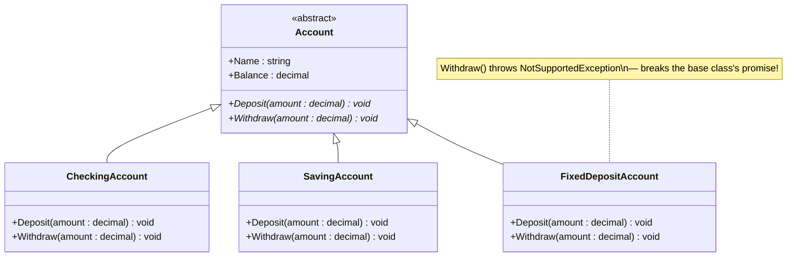
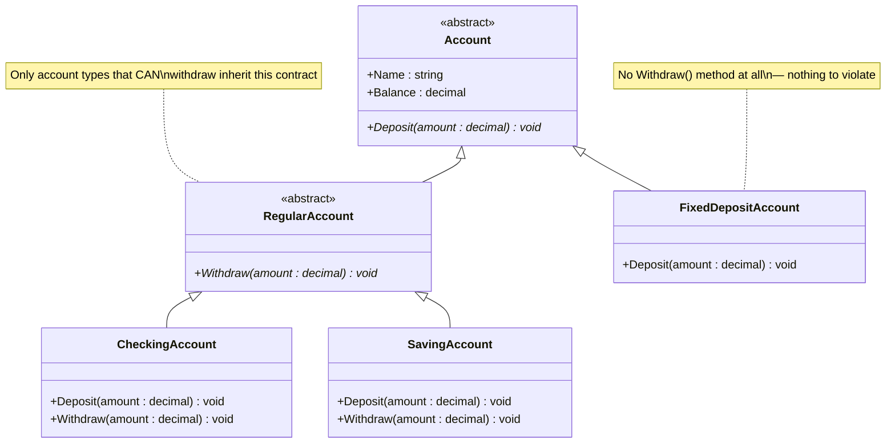

# SOLID — Liskov Substitution Principle (LSP)

> Objects of a superclass should be **replaceable with objects of a subclass** without breaking the correctness of the program.
>
> In other words: if `B` is a subclass of `A`, you should be able to use a `B` **anywhere** an `A` is expected, and the program should keep behaving correctly — no surprises, no crashes, no silently-ignored behavior.

---

## What LSP Actually Means

LSP is not just "can `B` inherit from `A`?" (that's a compiler question). It's "**does `B` honor the *contract* that `A` promises?**"

A base class's public methods form a **contract** — a promise about what will happen when you call them. Every subclass must uphold that same promise:

- It must **not** throw an exception where the base type promised a normal result.
- It must **not** silently do nothing where the base type promised an effect.
- It must **not** weaken guarantees or add surprising restrictions that callers relying on the base type wouldn't expect.

If a subclass can't honestly fulfill part of the base class's contract, it **should not inherit that part of the contract at all** — the fix is to redesign the hierarchy, not to make the subclass "fake" the behavior (e.g. by throwing, or doing nothing).

---

## 1) The Problem — Before (Violating LSP)

`Account` declares both `Deposit(decimal)` and `Withdraw(decimal)` as abstract methods that **every** account type must implement. But not every account can actually support withdrawals in a meaningful way:

- `CheckingAccount` → withdraws normally (with a $1000 limit).
- `SavingAccount` → withdraws normally.
- `FixedDepositAccount` → **cannot** be withdrawn from at all — so it's forced to implement `Withdraw()` anyway, and the only thing it can do is `throw new NotSupportedException(...)`.

### UML



### Code

**`Account.cs`**
```csharp
namespace SOLID.LSP.Before
{
    abstract class Account
    {
        protected Account(string name, decimal balance)
        {
            Name = name;
            Balance = balance;
        }

        public string Name { get; set; }
        public decimal Balance { get; set; }

        public abstract void Deposit(decimal amount);
        public abstract void Withdraw(decimal amount);
    }
}
```

**`CheckingAccount.cs`**
```csharp
using System;

namespace SOLID.LSP.Before
{
    class CheckingAccount : Account
    {
        public CheckingAccount(string name, decimal balance)
            : base(name, balance)
        {
        }

        public override void Deposit(decimal amount)
        {
            Balance += amount;
        }

        public override void Withdraw(decimal amount)
        {
            if (amount > 1000)
            {
                Console.WriteLine("You cant withdram more than $1000");
                return;
            }
            Balance -= amount;
        }
    }
}
```

**`SavingAccount.cs`**
```csharp
namespace SOLID.LSP.Before
{
    class SavingAccount : Account
    {
        public SavingAccount(string name, decimal balance)
            : base(name, balance)
        {
        }

        public override void Deposit(decimal amount)
        {
            Balance += amount;
        }

        public override void Withdraw(decimal amount)
        {
            Balance -= amount;
        }
    }
}
```

**`FixedDepositAccount.cs`** — the violation:
```csharp
using System;

namespace SOLID.LSP.Before
{
    class FixedDepositAccount : Account
    {
        public FixedDepositAccount(string name, decimal balance)
            : base(name, balance)
        {
        }

        public override void Deposit(decimal amount)
        {
            Balance += amount;
        }

        public override void Withdraw(decimal amount)
        {
            throw new NotSupportedException($"You can not withdraw from Fixed Deposit Account!!!");
        }
    }
}
```

### Why This Breaks LSP

Imagine code written against the base `Account` type, trusting its contract:

```csharp
void ProcessWithdrawal(Account account, decimal amount)
{
    account.Withdraw(amount); // the Account contract promises this "just works"
}
```

This method is perfectly correct for `CheckingAccount` and `SavingAccount`. But the moment you substitute a `FixedDepositAccount` — which is exactly what LSP says you should be able to do safely — **the program crashes** with a `NotSupportedException`.

- ❌ `FixedDepositAccount` **is not truly substitutable** for `Account`, even though it compiles and inherits from it.
- ❌ Any code that treats all `Account`s uniformly (loops, polymorphic collections, generic processing) is a landmine: it works for most accounts and explodes for one specific type.
- ❌ The abstraction (`Account`) is **lying** — it promises a `Withdraw` capability that not every subtype can honor.
- ❌ Callers are forced to know about the exception and add special-case handling (`try/catch` or `if (account is FixedDepositAccount)`), which defeats the entire purpose of having a shared abstraction.

---

## 2) The Solution — After (Following LSP)

The fix isn't to change *how* `Withdraw` behaves — it's to change the **shape of the hierarchy** so that `Withdraw` is only ever promised by types that can actually support it.

A new abstract class, `RegularAccount`, sits between `Account` and the withdrawable account types. It adds the `Withdraw` contract **only** for accounts that can truly fulfill it. `FixedDepositAccount` now inherits directly from `Account` and is never asked to implement `Withdraw` at all.

### UML



### Code

**`Account.cs`** — now only promises what *every* account can do:
```csharp
namespace SOLID.LSP.After
{
    abstract class Account
    {
        protected Account(string name, decimal balance)
        {
            Name = name;
            Balance = balance;
        }

        public string Name { get; set; }
        public decimal Balance { get; set; }

        public abstract void Deposit(decimal amount);
    }
}
```

**`RegularAccount.cs`** — a new intermediate abstraction for withdrawable accounts:
```csharp
namespace SOLID.LSP.After
{
    abstract class RegularAccount : Account
    {
        protected RegularAccount(string name, decimal balance)
            : base(name, balance)
        {
            Name = name;
            Balance = balance;
        }

        public abstract void Withdraw(decimal amount);
    }
}
```

**`CheckingAccount.cs`** — inherits from `RegularAccount`:
```csharp
using System;

namespace SOLID.LSP.After
{
    class CheckingAccount : RegularAccount
    {
        public CheckingAccount(string name, decimal balance)
            : base(name, balance)
        {
        }

        public override void Deposit(decimal amount)
        {
            Balance += amount;
        }

        public override void Withdraw(decimal amount)
        {
            if (amount > 1000)
            {
                Console.WriteLine("You cant withdram more than $1000");
                return;
            }
            Balance -= amount;
        }
    }
}
```

**`SavingAccount.cs`** — inherits from `RegularAccount`:
```csharp
namespace SOLID.LSP.After
{
    class SavingAccount : RegularAccount
    {
        public SavingAccount(string name, decimal balance)
            : base(name, balance)
        {
        }

        public override void Deposit(decimal amount)
        {
            Balance += amount;
        }

        public override void Withdraw(decimal amount)
        {
            Balance -= amount;
        }
    }
}
```

**`FixedDepositAccount.cs`** — inherits directly from `Account`, no `Withdraw` to fake:
```csharp
namespace SOLID.LSP.After
{
    class FixedDepositAccount : Account
    {
        public FixedDepositAccount(string name, decimal balance)
            : base(name, balance)
        {
        }

        public override void Deposit(decimal amount)
        {
            Balance += amount;
        }
    }
}
```

### Why This Now Honors LSP

```csharp
void ProcessWithdrawal(RegularAccount account, decimal amount)
{
    account.Withdraw(amount); // guaranteed to be a real, valid operation
}
```

- ✅ Any code that calls `Withdraw` now works with **`RegularAccount`**, not `Account` — and every `RegularAccount` (checking, saving, or any future type) can genuinely fulfill that contract.
- ✅ `FixedDepositAccount` is still a fully valid `Account` — it can be deposited into, displayed, listed alongside other accounts — but it's **never asked to promise something it can't deliver.**
- ✅ There is no exception hiding inside an override, and no caller needs special-case `try/catch` or type-checking logic.
- ✅ Substituting any subclass of `RegularAccount` (or of `Account`) for its base type never breaks the program — exactly what LSP requires.

---

## Comparing the Two Approaches

| | Before (Violating LSP) | After (Following LSP) |
|---|---|---|
| Who promises `Withdraw`? | `Account` (all account types) | `RegularAccount` (only withdrawable types) |
| `FixedDepositAccount.Withdraw()` | Throws `NotSupportedException` | Doesn't exist — nothing to violate |
| Substituting any subtype for its base type | Unsafe — can throw at runtime | Always safe |
| Caller needs special-case handling | Yes (`try/catch` or type checks) | No |
| Hierarchy shape | Flat: 1 base + 3 direct subclasses | Layered: `Account` → `RegularAccount` → withdrawable types |

---

## Key Takeaway

> If a subclass can't honestly support part of its base class's contract, don't force it to implement that part anyway — a `throw` or a no-op inside an override is a sign the **hierarchy is wrong**, not that the subclass is broken. Restructure the abstraction so that each contract is only promised by the types that can actually keep it. Then any subtype can always safely replace its base type, anywhere, with no surprises.
