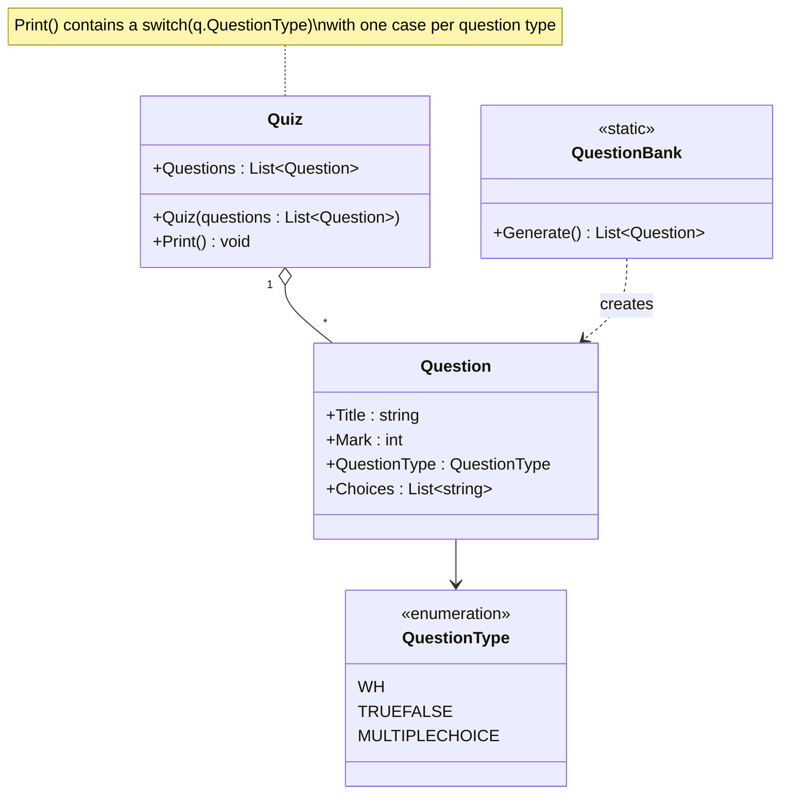
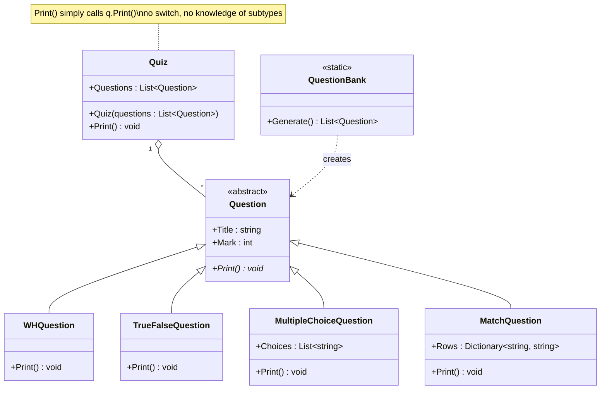

# SOLID — Open/Closed Principle (OCP)

> Software entities (classes, modules, functions) should be **open for extension, but closed for modification.**

- **Open for extension** → you can add new behavior
- **Closed for modification** → you add it **without changing existing, already-tested code**

---

## The Idea

In the "before" version, `Question` is a single class with a `QuestionType` enum field, and `Quiz.Print()` contains a `switch` statement that branches on that enum to decide how to render each question.

The moment we need to support a **new question type** (like a "Match the following" question), we're forced to:

1. Add a new value to the `QuestionType` enum.
2. Add a new `case` to the `switch` statement inside `Quiz.Print()`.
3. Possibly add new properties to `Question` itself (e.g. a `Rows` dictionary for matching pairs) — properties that are **meaningless** for every other question type.

Every new question type means **editing existing, already-working code** — the `Quiz` class and the `Question` class are never "done"; they must be reopened again and again.

The "after" version fixes this with **polymorphism**: `Question` becomes an `abstract` class with an `abstract Print()` method. Each question type is its **own subclass** that implements `Print()` in its own way. `Quiz.Print()` no longer needs to know about question types at all — it just calls `q.Print()` and lets polymorphism do the work.

Now adding a new question type (like `MatchQuestion`) means **creating a new class** — `Quiz` and the existing question classes are never touched.

---

## 1) The Problem — Before (Violating OCP)

A single `Question` class carries a `QuestionType` enum, and `Quiz.Print()` branches on it with a `switch`.

### UML



### Code

**`QuestionType.cs`**
```csharp
namespace SOLID.OCP.Before
{
    enum QuestionType
    {
        WH,
        TRUEFALSE,
        MULTIPLECHOICE
    }
}
```

**`Question.cs`**
```csharp
using System.Collections.Generic;

namespace SOLID.OCP.Before
{
    class Question
    {
        public string Title { get; set; }
        public int Mark { get; set; }
        public QuestionType QuestionType { get; set; }
        public List<string> Choices { get; set; } = new List<string>();
    }
}
```

**`Quiz.cs`**
```csharp
using System;
using System.Collections.Generic;

namespace SOLID.OCP.Before
{
    class Quiz
    {
        public List<Question> Questions { get; }

        public Quiz(List<Question> questions)
        {
            this.Questions = questions;
        }

        public void Print()
        {
            foreach (var q in Questions)
            {
                Console.WriteLine($"{q.Title} [{q.Mark}]");
                switch (q.QuestionType)
                {
                    case QuestionType.WH:
                        Console.WriteLine("  _____________________________");
                        Console.WriteLine("  _____________________________");
                        Console.WriteLine("  _____________________________");
                        break;
                    case QuestionType.TRUEFALSE:
                        Console.WriteLine("  1. T");
                        Console.WriteLine("  2. F");
                        break;
                    case QuestionType.MULTIPLECHOICE:
                        foreach (var choice in q.Choices)
                        {
                            Console.WriteLine($"  {choice}");
                        }
                        break;
                    default: break;
                }
                Console.WriteLine("\n\n");
            }
        }
    }
}
```

**`QuestionBank.cs`**
```csharp
using System.Collections.Generic;

namespace SOLID.OCP.Before
{
    internal static class QuestionBank
    {
        public static List<Question> Generate()
        {
            return new List<Question>
            {
                new Question
                {
                    Title = "What are the four pillars of OOP?",
                    QuestionType = QuestionType.WH,
                    Mark = 8
                },
                new Question
                {
                    Title = "Which of the following are value types?",
                    QuestionType = QuestionType.MULTIPLECHOICE,
                    Mark = 6,
                    Choices = new List<string>
                    {
                        "A: Integer", "B: Array", "C: Single", "D: String", "E: Long",
                    }
                },
                new Question
                {
                    Title = "Earth is Bigger than sun?",
                    QuestionType = QuestionType.TRUEFALSE,
                    Mark = 4
                },
                new Question
                {
                    Title = "Which of the following is an 8-byte Integer?",
                    QuestionType = QuestionType.MULTIPLECHOICE,
                    Mark = 6,
                    Choices = new List<string>
                    {
                        "A.  Char", "B.  Long", "C.  Short", "D.  Byte", "E.  Integer"
                    }
                }
            };
        }
    }
}
```

### The Problem: Adding a New Question Type

Say we now need a **"Match the following"** question type. With this design we're forced to:

| Step | File touched | Why |
|---|---|---|
| 1 | `QuestionType.cs` | Add a new `MATCH` enum value |
| 2 | `Question.cs` | Add a new `Rows : Dictionary<string,string>` property — even though it's irrelevant for `WH` and `TRUEFALSE` questions |
| 3 | `Quiz.cs` | Add a new `case QuestionType.MATCH:` branch inside the `switch` |

**Every single one of those files is existing, already-tested code that must be reopened and modified.** This is the definition of violating OCP:

- ❌ `Quiz` is never "closed" — every new question type reopens its `Print()` method.
- ❌ `Question` becomes a bloated "god class" holding properties for every question type combined (`Choices` for multiple-choice, and it would need `Rows` for matching, etc.), even though a `TRUEFALSE` question never uses either.
- ❌ The `switch` statement grows forever, and it's easy to forget a `case` for a new type, causing silent bugs (falls to `default`).
- ❌ Changing rendering logic for one question type risks breaking the `switch` for the others.

---

## 2) The Solution — After (Following OCP)

`Question` becomes an `abstract` base class with an `abstract Print()` method. Each question type is a separate subclass that implements its own rendering. `Quiz.Print()` never branches on type — it simply calls polymorphic `Print()`.

### UML



**Notation:** hollow triangle (`◁——`) = **Inheritance**; `*` next to `Print()` marks it **abstract**.

### Code

**`Question.cs`** — abstract base, defines the contract:
```csharp
namespace SOLID.OCP.After
{
    abstract class Question
    {
        public string Title { get; set; }
        public int Mark { get; set; }

        public abstract void Print();
    }
}
```

**`WHQuestion.cs`**
```csharp
using System;

namespace SOLID.OCP.After
{
    class WHQuestion : Question
    {
        public override void Print()
        {
            Console.WriteLine($"{Title} [{Mark}]");
            Console.WriteLine("  _____________________________");
            Console.WriteLine("  _____________________________");
            Console.WriteLine("  _____________________________");
        }
    }
}
```

**`TrueFalseQuestion.cs`**
```csharp
using System;

namespace SOLID.OCP.After
{
    class TrueFalseQuestion : Question
    {
        public override void Print()
        {
            Console.WriteLine($"{Title} [{Mark}]");
            Console.WriteLine("  1. T");
            Console.WriteLine("  2. F");
        }
    }
}
```

**`MultipleChoiceQuestion.cs`**
```csharp
using System;
using System.Collections.Generic;

namespace SOLID.OCP.After
{
    class MultipleChoiceQuestion : Question
    {
        public List<string> Choices { get; set; } = new List<string>();

        public override void Print()
        {
            Console.WriteLine($"{Title} [{Mark}]");

            foreach (var choice in Choices)
            {
                Console.WriteLine($"  {choice}");
            }
        }
    }
}
```

**`MatchQuestion.cs`** — the new type, added without touching anything else:
```csharp
using System;
using System.Collections.Generic;

namespace SOLID.OCP.After
{
    class MatchQuestion : Question
    {
        public Dictionary<string, string> Rows { get; set; } = new Dictionary<string, string>();

        public override void Print()
        {
            Console.WriteLine($"{Title} [{Mark}]");

            foreach (var item in Rows)
            {
                Console.WriteLine($"{item.Key}            {item.Value}");
            }
        }
    }
}
```

**`Quiz.cs`** — no longer knows about question types:
```csharp
using System;
using System.Collections.Generic;

namespace SOLID.OCP.After
{
    class Quiz
    {
        public List<Question> Questions { get; }

        public Quiz(List<Question> questions)
        {
            this.Questions = questions;
        }

        public void Print()
        {
            foreach (var q in Questions)
            {
                q.Print();
                Console.WriteLine("\n\n");
            }
        }
    }
}
```

**`QuestionBank.cs`**
```csharp
using System.Collections.Generic;

namespace SOLID.OCP.After
{
    internal static class QuestionBank
    {
        public static List<Question> Generate()
        {
            return new List<Question>
            {
                new WHQuestion
                {
                    Title = "What are the four pillars of OOP?",
                    Mark = 8
                },
                new MultipleChoiceQuestion
                {
                    Title = "Which of the following are value types?",
                    Mark = 6,
                    Choices = new List<string>
                    {
                        "A: Integer", "B: Array", "C: Single", "D: String", "E: Long",
                    }
                },
                new TrueFalseQuestion
                {
                    Title = "Earth is Bigger than sun?",
                    Mark = 4
                },
                new MultipleChoiceQuestion
                {
                    Title = "Which of the following is an 8-byte Integer?",
                    Mark = 6,
                    Choices = new List<string>
                    {
                        "A.  Char", "B.  Long", "C.  Short", "D.  Byte", "E.  Integer"
                    }
                },
                new MatchQuestion
                {
                    Title = "Match Column One values with single choice from 2nd Column?",
                    Mark = 10,
                    Rows = new Dictionary<string, string>
                    {
                        { "A", "b" }, { "B", "c" }, { "C", "a" }, { "D", "e" }, { "E", "d" }
                    }
                }
            };
        }
    }
}
```

### Adding `MatchQuestion` — What Actually Changed

| Step | File touched | Why |
|---|---|---|
| 1 | `MatchQuestion.cs` (**new file**) | Defines the new type and its own `Print()` |
| 2 | `QuestionBank.cs` | Only to *add sample data* — not core logic |

**`Question.cs` and `Quiz.cs` were never opened.** That's OCP in action: the system was extended with new behavior while the existing, tested classes remained completely untouched.

---

## Comparing the Two Approaches

| | Before (Violating OCP) | After (Following OCP) |
|---|---|---|
| How question rendering is chosen | `switch (q.QuestionType)` inside `Quiz` | Polymorphic `q.Print()` — no branching |
| Adding a new question type | Edit `QuestionType` enum, `Question` class, **and** `Quiz.Print()` | Add **one new class**; nothing else changes |
| Risk when adding a type | High — shared `switch` and shared `Question` class can break other types | Low — new class is fully isolated |
| `Question` class shape | One bloated class with properties for every type combined | Clean `abstract` contract; each subtype owns only what it needs |
| Testability | Must test the whole `switch` block together | Each question type tested independently |

---

## Key Takeaway

> Don't design classes that must be edited every time a new variation shows up. Instead, define a stable **abstraction** (an abstract class or interface) that existing code depends on, and add new behavior by **creating new classes** that implement it. The system grows through **extension**, not through **modification** of code that already works.
