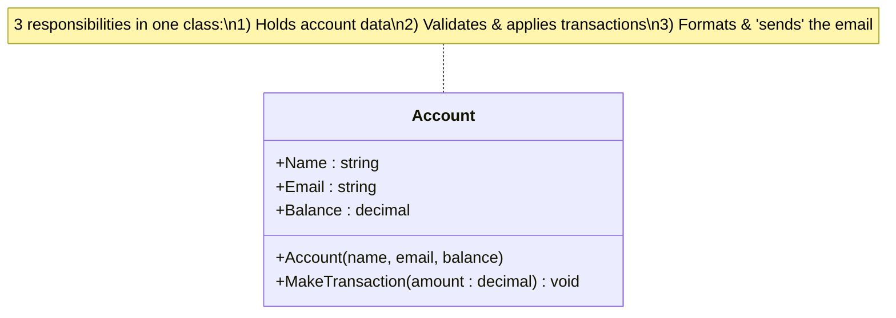
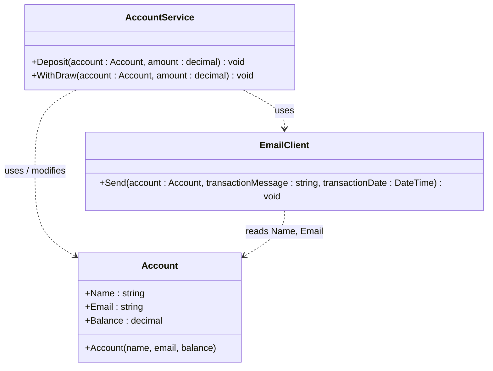

# SOLID — Single Responsibility Principle (SRP)

> A class should have **one, and only one, reason to change.**

- **One responsibility** → the class does exactly one job
- **One reason to change** → if you rewrite the requirement for that one job, only that class changes; everything else is untouched

---

## The Idea

The `Account` class in the "before" version wears three hats at once:

1. It's a **data model** holding account state (`Name`, `Email`, `Balance`).
2. It contains the **business logic** for deposits/withdrawals (`MakeTransaction`).
3. It's responsible for **sending emails** (the `Console.WriteLine` notification block).

That's **three separate reasons to change**: a change to how transactions are validated, a change to how balances are represented, or a change to how notifications are formatted/delivered (e.g. switching from console output to a real SMTP email) would all force you to edit the very same `Account` class.

SRP says: split each responsibility into its **own class**. In the "after" version:

- `Account` → only holds **data** (name, email, balance).
- `AccountService` → only holds **transaction logic** (deposit/withdraw rules).
- `EmailClient` → only holds **notification logic** (formatting & sending the message).

Now each class has exactly one reason to change.

---

## 1) The Problem — Before (Violating SRP)

`Account` mixes data, business rules, and notification/formatting logic all in a single class.

### UML



### Code

```csharp
using System;

namespace SOLID.SRP.Before
{
    internal class Account
    {
        public string Name { get; set; }
        public string Email { get; set; }
        public decimal Balance { get; set; }

        public Account(string name, string email, decimal balance)
        {
            this.Name = name;
            this.Email = email;
            this.Balance = balance;
        }

        public void MakeTransaction(decimal amount) // amount +/-
        {
            var transactionMessage = "";

            // handle withdraw
            if (amount < 0)
            {
                if (Balance < Math.Abs(amount))
                {
                    transactionMessage =
                        $"OVERDRAFT when trying to withdraw " +
                        $"{Math.Abs(amount).ToString("C2")}," +
                        $" current balance {Balance.ToString("C2")}";
                }
                else
                {
                    this.Balance += amount;
                    transactionMessage =
                        $"OK Withdraw {Math.Abs(amount).ToString("C2")}" +
                        $", current balance {Balance.ToString("C2")}";
                }
            }
            else
            {
                // handle deposit
                if (amount > 0)
                {
                    this.Balance += amount;

                    transactionMessage =
                        $"OK Deposit {amount.ToString("C2")}" +
                        $", current balance {Balance.ToString("C2")}";
                }
            }

            // mock process for sending email
            Console.WriteLine(
                $"\n\n\t\t To: {Email}" +
                $"\n\t\t Subject: Fake Bank Account Activity" +
                $"\n\n\t\t Dear {Name}," +
                $"\n\n\t\t\t A recent activity on your account occures at {DateTime.Now.ToString("yyyy-MM-dd hh:mm")}" +
                "\n\t\t\t\t ===> {0}" +
                $"\n\n\t\t Thank You,\n\t\t Fake Bank." +
                $"\n\n\t\t--------------------------- ", transactionMessage);
        }
    }
}
```

### Key Problems

- **Data model, business rules, and I/O/formatting live in the same class.** Three unrelated concerns → three unrelated reasons to change.
- Changing the transaction rules (e.g. adding a minimum-balance policy) risks breaking the email-formatting code, and vice versa.
- `Account` can't be unit-tested for balance logic without also running (and asserting against) console output.
- If the app later needs to send **real** emails (SMTP, SendGrid, etc.), you must dig into `Account` and touch data-holding code that has nothing to do with email.
- The class can't be reused as a plain data object (e.g. for serialization/DTOs) without dragging the transaction and notification logic along with it.

---

## 2) The Solution — After (Following SRP)

Each concern now lives in its own class, each with a single, focused responsibility.

### UML



**Notation:** dashed arrow (`┄┄▷`) = **Dependency ("uses")** — a class calls or reads from another, without owning or inheriting it.

| Class | Single Responsibility | Reason to change |
|---|---|---|
| `Account` | Hold account **data** | The shape of account data changes (e.g. add `AccountNumber`) |
| `AccountService` | Apply **business rules** for deposit/withdraw | The transaction rules change (e.g. add fees, limits) |
| `EmailClient` | Format & **send** the notification | The notification channel/format changes (e.g. switch to real SMTP, change the template) |

### Code

**`Account.cs`** — pure data holder:

```csharp
namespace SOLID.SRP.After
{
    internal class Account
    {
        public string Name { get; set; }
        public string Email { get; set; }
        public decimal Balance { get; set; }

        public Account(string name, string email, decimal balance)
        {
            this.Name = name;
            this.Email = email;
            this.Balance = balance;
        }
    }
}
```

**`AccountService.cs`** — business/transaction logic:

```csharp
using System;

namespace SOLID.SRP.After
{
    internal class AccountService
    {
        public void Deposit(Account account, decimal amount)
        {
            var transactionMessage = "";

            if (amount > 0)
            {
                account.Balance += amount;

                transactionMessage =
                    $"OK Deposit {amount.ToString("C2")}" +
                    $", current balance {account.Balance.ToString("C2")}";
            }

            var emailClient = new EmailClient();
            emailClient.Send(account, transactionMessage, DateTime.Now);
        }

        public void WithDraw(Account account, decimal amount)
        {
            var transactionMessage = "";

            if (account.Balance < amount)
            {
                transactionMessage =
                    $"OVERDRAFT when trying to withdraw " +
                    $"{Math.Abs(amount).ToString("C2")}," +
                    $" current balance {account.Balance.ToString("C2")}";
            }
            else
            {
                account.Balance -= amount;
                transactionMessage =
                    $"OK Withdraw {Math.Abs(amount).ToString("C2")}" +
                    $", current balance {account.Balance.ToString("C2")}";
            }

            var emailClient = new EmailClient();
            emailClient.Send(account, transactionMessage, DateTime.Now);
        }
    }
}
```

**`EmailClient.cs`** — notification formatting & delivery:

```csharp
using System;

namespace SOLID.SRP.After
{
    internal class EmailClient
    {
        public void Send(Account account, string transactionMessage, DateTime transactionDate)
        {
            Console.WriteLine(
                $"\n\n\t\t To: {account.Email}" +
                $"\n\t\t Subject: Fake Bank Account Activity" +
                $"\n\n\t\t Dear {account.Name}," +
                $"\n\n\t\t\t A recent activity on your account occures at {transactionDate.ToString("yyyy-MM-dd hh:mm")}" +
                "\n\t\t\t\t ===> {0}" +
                $"\n\n\t\t Thank You,\n\t\t Fake Bank." +
                $"\n\n\t\t--------------------------- ", transactionMessage);
        }
    }
}
```

### Key Benefits

- **`Account`** is a plain, reusable data object — safe to serialize, pass around, or use as a DTO, with zero business logic attached.
- **`AccountService`** can be unit-tested for balance/overdraft rules by injecting a fake `EmailClient` (or by extracting an `IEmailClient` interface, going one step further with **Dependency Inversion**).
- **`EmailClient`** can be swapped for a real SMTP/SendGrid implementation without touching `Account` or `AccountService` at all.
- Each class can be understood, tested, and modified **in isolation** — exactly what SRP promises.

---

## Comparing the Two Approaches

| | Before (Violating SRP) | After (Following SRP) |
|---|---|---|
| Responsibilities per class | 3 (data + business rules + notification) | 1 per class |
| Reasons to change `Account` | Data shape, transaction rules, **and** email format | Only data shape |
| Testability | Hard — logic and I/O are entangled | Easy — each class tested independently |
| Reusability | `Account` can't be reused without its logic | `Account` is a clean, reusable data object |
| Extending notifications (e.g. real email/SMS) | Requires editing `Account` | Only `EmailClient` changes |

---

## Key Takeaway

> When a class has more than one reason to change, it has more than one responsibility — and that makes it fragile and hard to maintain. Split each responsibility into its own class so that **each class changes for exactly one reason**, and the rest of the system stays untouched.
