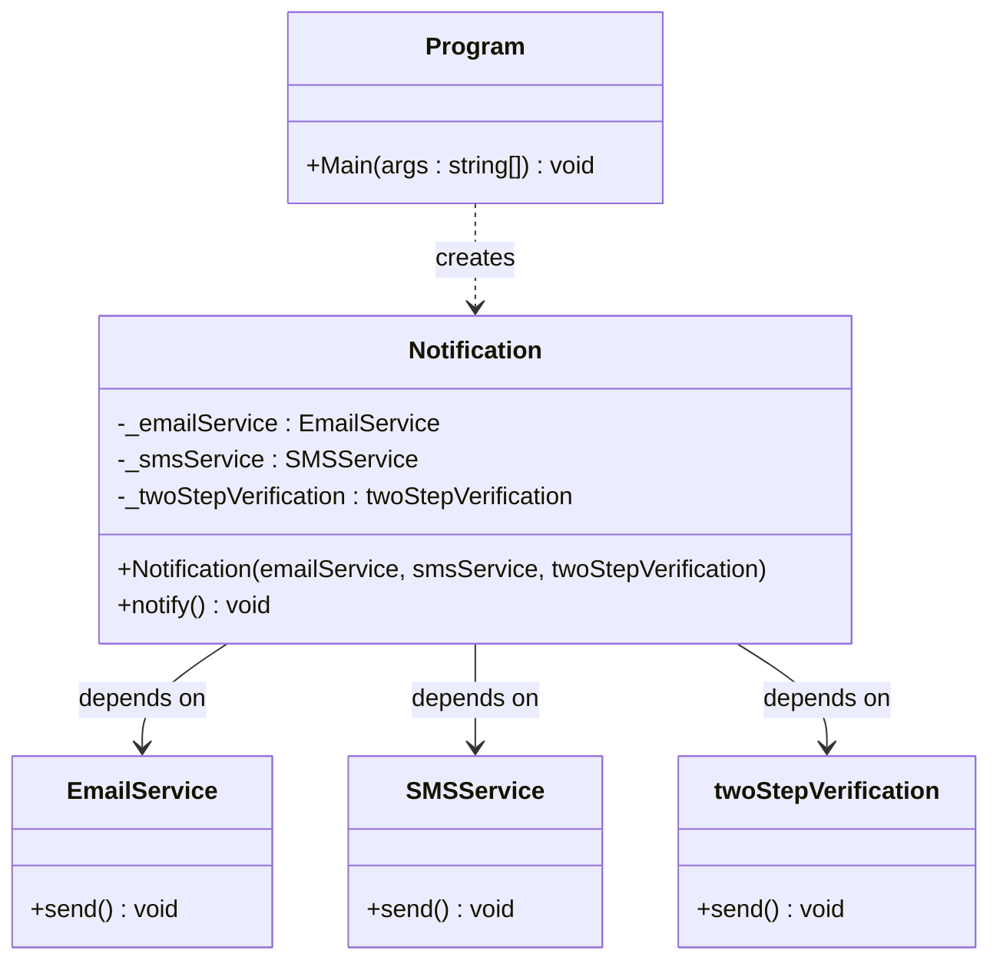
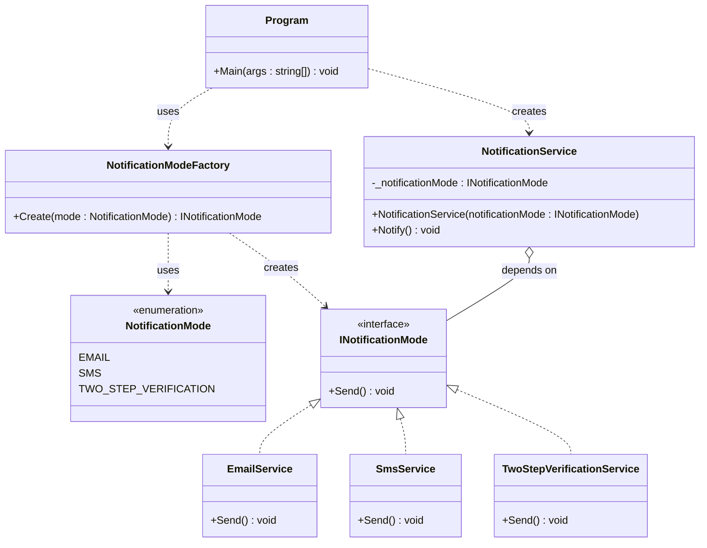

# Tightly Coupled vs Loosely Coupled

> **Tight coupling** happens when a class depends directly on other **concrete** classes.
> **Loose coupling** happens when a class depends on an **abstraction** (interface), and the concrete implementation is provided from the outside.

- **Tightly coupled** → hard to extend, hard to test, every new option means editing existing classes
- **Loosely coupled** → easy to extend, easy to test, new options are added without touching existing code

---

## The Idea

In the "before" version, `Notification` is **hard-wired** to three specific classes: `EmailService`, `SMSService`, and `twoStepVerification`. It creates a direct, permanent dependency on each of them — if you want to add a new channel (e.g. push notifications) or remove one, you must **edit the `Notification` class itself**.

In the "after" version, `NotificationService` doesn't know (or care) which concrete service it's using. It only depends on the `INotificationMode` **interface**. A `NotificationModeFactory` is responsible for deciding *which* concrete class to create, based on an `enum`. This is the same **Encapsulate What Varies** idea applied together with an abstraction: the varying part (which service to use) is isolated behind an interface and a factory.

---

## 1) The Problem — Tightly Coupled

`Notification` directly creates/depends on `EmailService`, `SMSService`, and `twoStepVerification` — three concrete classes, with no shared abstraction between them.

### UML



**Notation:** a plain solid arrow (`——▷`) here means a **direct dependency on a concrete class** (no interface in between).

### Code

```csharp
using System;
using System.Threading;

namespace DesignPrinciples.EncapsulateWhatVarient
{
    class Program
    {
        static void Main(string[] args)
        {
            Notification notification = new Notification(new EmailService()
                , new SMSService(), new twoStepVerification());

            notification.notify();
        }
    }

    class Notification
    {
        private readonly EmailService _emailService;
        private readonly SMSService _smsService;
        private readonly twoStepVerification _twoStepVerification;

        public Notification(EmailService emailService,
            SMSService sMSService, twoStepVerification twoStepVerification)
        {
            _emailService = emailService;
            _smsService = sMSService;
            _twoStepVerification = twoStepVerification;
        }

        public void notify()
        {
            _emailService.send();
            _smsService.send();
            _twoStepVerification.send();
        }
    }

    class EmailService
    {
        public void send()
        {
            Console.WriteLine("Email sent");
        }
    }

    class SMSService
    {
        public void send()
        {
            Console.WriteLine("SMS sent");
        }
    }

    class twoStepVerification
    {
        public void send()
        {
            Console.WriteLine("code sent");
        }
    }
}
```

### Key Problems

- `Notification` must send **all three** channels every time — there's no way to notify with just one.
- Adding a new channel (e.g. Push notification) means **editing the `Notification` class** and its constructor.
- `Notification` is impossible to unit-test in isolation — it always instantiates real services.
- There is **no shared contract** between `EmailService`, `SMSService`, and `twoStepVerification`; they just happen to have a similarly-named method.

---

## 2) The Solution — Loosely Coupled

`NotificationService` depends only on the `INotificationMode` **interface**. A `NotificationModeFactory` decides which concrete implementation (`EmailService`, `SmsService`, or `TwoStepVerificationService`) to hand it, based on an `enum`.

> Renamed `WeirdService` → `TwoStepVerificationService` to match the domain from the "before" example.

### UML



**Notation:**
- Dashed hollow triangle (`◁┄┄`) = **Realization (Interface Implementation)**
- Hollow diamond arrow (`○——`) = **Aggregation** (`NotificationService` holds a reference to an `INotificationMode`, injected from outside)
- Dashed arrow (`┄┄▷`) = **Dependency ("uses")**

### Code

```csharp
using System;

namespace CATightlyVsLooselyCoupled
{
    internal class Program
    {
        static void Main(string[] args)
        {
            var serviceMode = NotificationModeFactory.Create(NotificationMode.TWO_STEP_VERIFICATION);
            NotificationService notificationService = new NotificationService(serviceMode);
            notificationService.Notify();
            Console.ReadKey();
        }
    }

    class NotificationModeFactory
    {
        public static INotificationMode Create(NotificationMode mode)
        {
            switch (mode)
            {
                case NotificationMode.EMAIL:
                    return new EmailService();

                case NotificationMode.SMS:
                    return new SmsService();

                case NotificationMode.TWO_STEP_VERIFICATION:
                    return new TwoStepVerificationService();

                default:
                    return new EmailService();
            }
        }
    }

    enum NotificationMode
    {
        EMAIL,
        SMS,
        TWO_STEP_VERIFICATION
    }

    interface INotificationMode
    {
        void Send();
    }

    class EmailService : INotificationMode
    {
        public void Send()
        {
            Console.WriteLine("email sent");
        }
    }

    class SmsService : INotificationMode
    {
        public void Send()
        {
            Console.WriteLine("sms sent");
        }
    }

    class TwoStepVerificationService : INotificationMode
    {
        public void Send()
        {
            Console.WriteLine("code sent");
        }
    }

    class NotificationService
    {
        private readonly INotificationMode _notificationMode;

        public NotificationService(INotificationMode notificationMode)
        {
            _notificationMode = notificationMode;
        }

        public void Notify()
        {
            _notificationMode.Send();
        }
    }
}
```

### Key Benefits

- `NotificationService` never references `EmailService`, `SmsService`, or `TwoStepVerificationService` directly — only the `INotificationMode` abstraction.
- Adding a new channel means **creating a new class** that implements `INotificationMode` and adding one `case` to the factory — **`NotificationService` itself is never touched**.
- `NotificationService` can be unit-tested with a mock/fake `INotificationMode`, with no real email/SMS being sent.
- The object creation logic (**what varies**) is isolated inside `NotificationModeFactory`, while `NotificationService` (**what's stable**) just uses whatever it's given.

---

## Comparing the Two Approaches

| | Tightly Coupled (Before) | Loosely Coupled (After) |
|---|---|---|
| Dependency type | Concrete classes | Interface (`INotificationMode`) |
| Adding a new channel | Edit `Notification`'s constructor & body | Add a new class + one factory `case` |
| Testability | Hard (real services always run) | Easy (interface can be mocked) |
| Who decides the implementation | The consuming class itself | An external factory |
| Number of channels used at once | Always all of them | Exactly one, chosen at runtime |

---

## Key Takeaway

> Depend on **abstractions**, not on **concrete implementations**. When a class new-s up its own dependencies, it becomes tightly coupled to them and hard to change. When a class receives an interface from the outside (**Dependency Injection**) and a factory decides which concrete type to provide, the class becomes loosely coupled — easy to extend, easy to swap, and easy to test.
